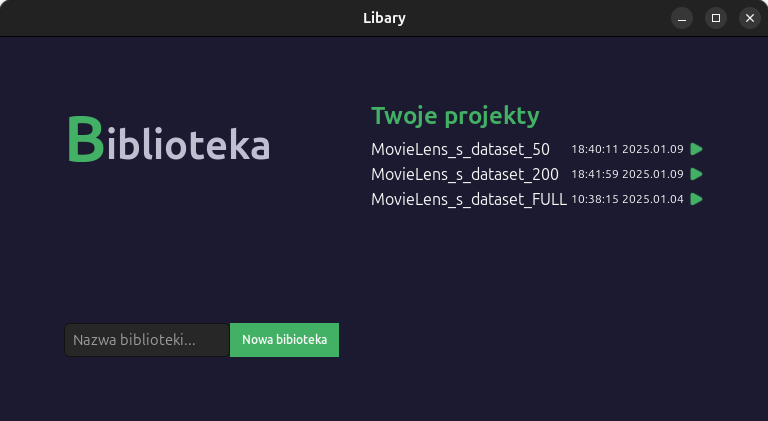
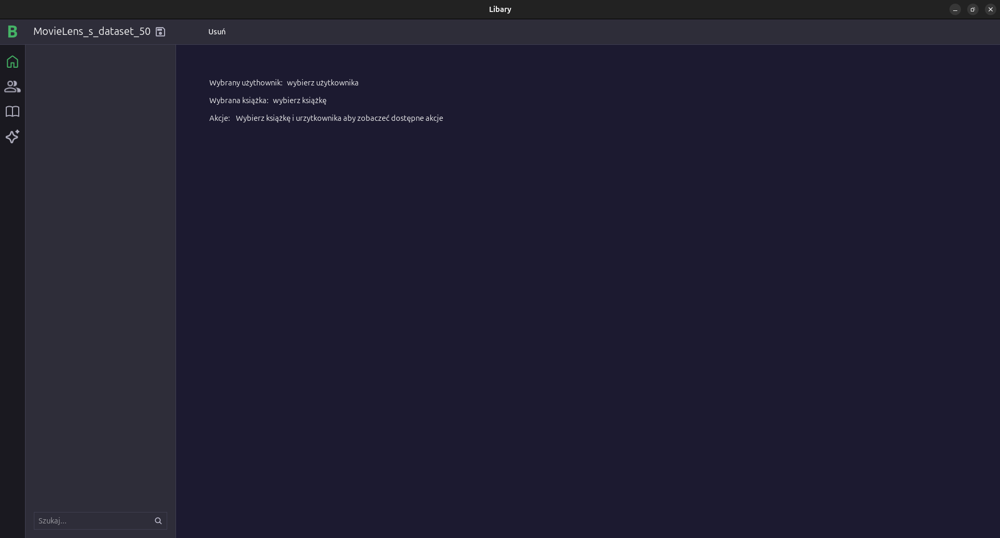
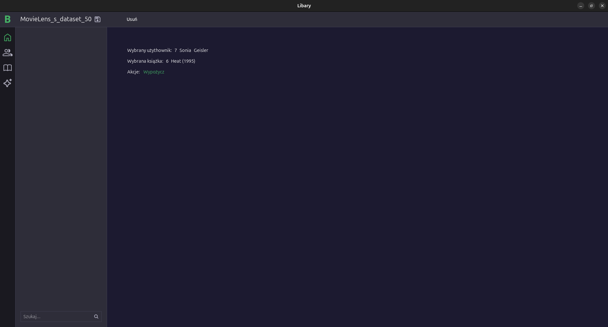
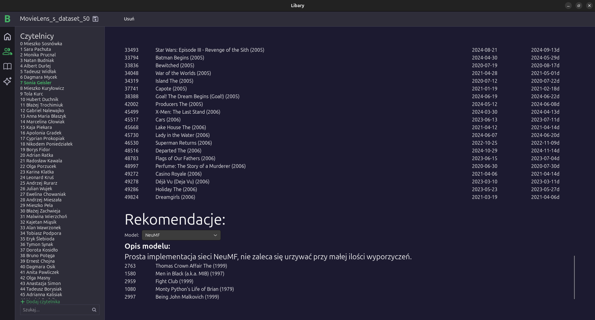
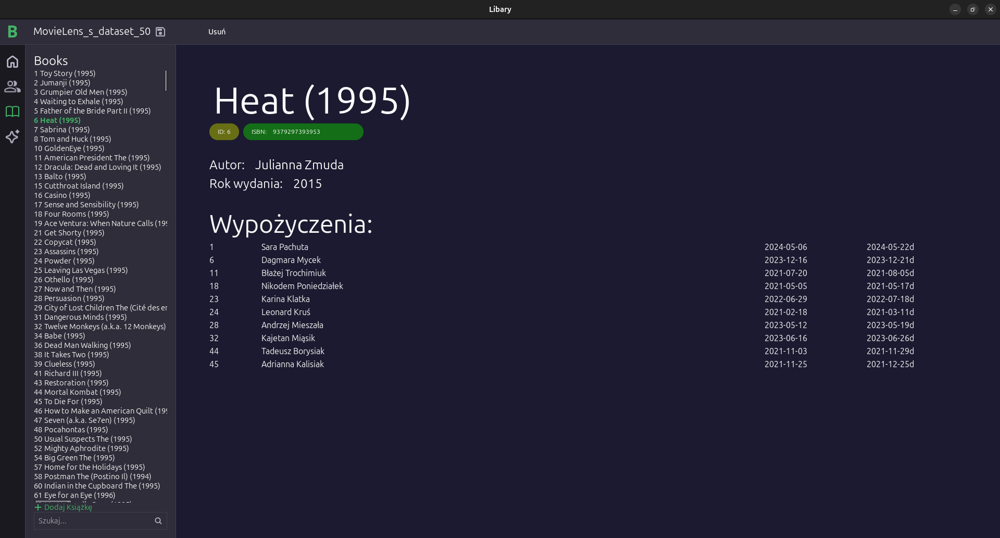
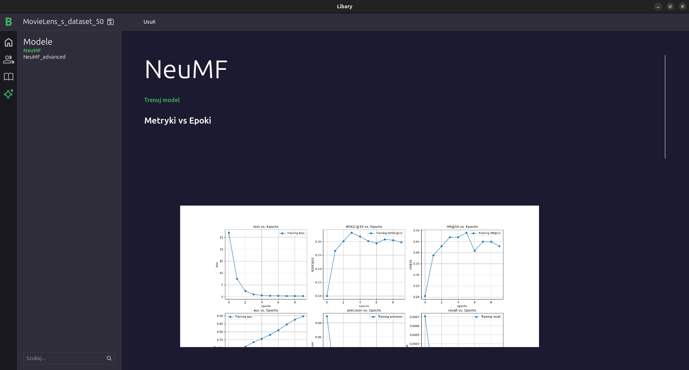
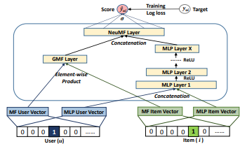

# Program "Biblioteka"
Program został stworzony w ramach projektu na zaliczenie przedmiotów "Kurs C" oraz "Uczenie Maszynowe".  

**Projekt obejmuje:**
- projekt graficzny aplikacji (program [Figma](https://www.figma.com/design/DAvdbbqJWTrbtWR9aTusEk/C_project?node-id=0-1&p=f&m=dev))
- stworzenie głównej aplikacji (język C, biblioteka GTK4)
- zintegrowanie z funkcją polecania książek dla użytkowników (język Python, biblioteka Keras)

# Instalacja, kompilacja i uruchomienie
**Ustawienie środowiska Pythona**

Utworzenie środowiska (tylko jeżeli nie istnieje)
```bash
  conda env create -f ML39_env.yml
``` 
Aktywacja środowiska
```bash
  conda activate ML39
``` 
**Kompilacja programu:**
```bash
  make
``` 
**Uruchomienie programu:**
```bash
  make run
``` 
albo
```bash
  ./Library
``` 
# Struktura folderów
**Folder główny "./"**
- `./app` - kod aplikacji
- `./build`- pliki buildu aplikacji
- `./images` - ikony i grafiki urzywane w projekcie
- `./ML` - pliki związane z uczeniem maszynowym

**Folder "./app"**
- `/components` - główne komponenty aplikacji
- `/data_types`- obsługa typów danych
- `/primitives` - komponenty "prymitywne" służące do budowania innych bardziej zaawansowanych 
- `/saves` - pliki zapisu danych

**Folder "./ML"**
- `/datasets` - zbiory danych
- `/model_architectures`- pliki do odtworzenia architektury modelu 
  - `[name].py` - architektura modelu
  - `[name]_hiper_params.json` - hiperparametry modelu
- `/models` - modele wytrenowane na pełnym datasecie

# Najważniejsze pliki
- `./Library` - plik wykonywalny aplikacji
- `./app/main.c` - plik główny programu
- `./app/styles.css` - arkusz stylów
- `./ML/prepare _model_architecture.ipynb` - notatnik do tworzenia architektur modeli
- `./ML/train_model.ipynb` - notatnik do trenowania modeli
- `./ML/train_model.py` - plik pythona do trenowania modelu przez aplikację
- `./ML/predict.py` - plik python do robienia predykcji przez aplikację
- `./ML/dataset_utils.py` - zbiór funkcji do obsługi datasetów
- `./ML/utils.py` - zbiór rozmaitych funkcji używanych przez inne pliki i notatniki pythona

# Program
## WELCOME 
Ekran powitalny aplikacji, umożliwia stworzenie nowego projektu lub wybranie już istniejącego.


## DASHBOARD 
Po wybraniu książki i użytkownika umożliwia wypożyczenie lub oddanie książki  
**Widok przed wybraniem użytkownika i książki:**

**Widok po wybraniu użytkownika i książki:**

 
## USERS 
Umożliwa wybranie użytkownika i pokazanie informacji o nim. Edytowanie odbywa się poprzez kliknięcie w tekst i rozpoczęcie pisania.  
Po wybraniu modelu pokazywane są rekomendacje.  
**Widok po wybraniu użytkownika:**

**Widok po po wybraniu modelu rekomendacji:**


## BOOKS 
Umożliwa wybranie książki i pokazanie informacji o niej. Edytowanie odbywa się poprzez kliknięcie w tekst i rozpoczęcie pisania.  
**Widok po wybraniu książki:**

## MODELS 
Umożliwa wybranie modelu i pokazanie informacji o nim. Po kliknięciu "Trening modelu" rozpoczyna się trening (uwaga, może trwać parę minut) 


# Datasets
W projekcie został użyty zbiór danych [MovieLens - ml-latest-small](https://grouplens.org/datasets/movielens/), który jest częstym wyborem do badań nad systemami rekomendacji  

Zawiera on onformacje o:
- 6,000 użytkownikach
- 9,000 filmach
- 100,000 opiniach

**Dlaczego został użyty dataset filmów?**  
Dla problemu rekomendacji nie ma różnicy czy rekomendowane są filmy czy książki, a ten zbiór danych jest w literaturze standardem dla szkolenia systemów rekomendacji.

**Przystosowanie do projektów w aplikacji**  
Domyślnie w aplikacji dostępne są 3 projekty:
- `MovieLens_s_dataset_50` - dataset `ml-latest-small` ograniczony do danych odnośnie pierwszych 50 użytkowników
- `MovieLens_s_dataset_200` - dataset `ml-latest-small` ograniczony do danych odnośnie pierwszych 200 użytkowników
- `MovieLens_s_dataset_FULL` - pełen dataset `ml-latest-small`

W MovieLens domyślnie podane były rankingi filmów, zostało to zmienione na interakcje (jeżeli film był oceniony to `interaction`=1)
# Wytrenowane modele
## Metoda ewaluacji "*leave-one-out*"
*Leave-one-out* jest standardem w ewaluacji systemów rekomendacji, polega na stworzenie datasetu testowego poprzez (dla każdego użytkownika):
- usunięcie ostatniej interakcji z datasetu treningowego i przerzucenie do datasetu testowego
- dodanie do datasetu testowego 100 itemów, z którymi nie zaistniała interakcja

Najpopularniejszymi metrykami w tej metodzie są:
- `HR@K` (Hit Rate at K) - określa w ilu procentach przypadków system przewidział prawdziwą interakcję w K najprawdopodobniejszych predykcjach
- `NDGC@K` (Normalized Discounted Cumulative Gain at K) - wskazuje jak wysoko w K najprawdopodobniejszych predykcjach znajduje się prawdziwa interakcja (1 dla prawdziwej interakcji zawsze na pierwszym miejscu)

## Model MF
**Wyniki wytrenowanego modelu**
|  | Mój MF | Orginalne NeuMF       | Orginalne NeuMF z pretreningiem       |
|-----------------|----------------|----------------|----------------|
| HR@10 | 0.820 | 0.705 | 0.730 |
| NDGC@10 | 0.597 | 0.426 | 0.447 |

\* Oryginalne modele były trenowane na pełnym datasecie, przy stałej ilości `latent_dim` równej 64 (najleprze zaraportowane wyniki przez autorów)

## Model NeuMF
Podstawę do budowania modelu stanowi praca [Neural Collaborative Filtering](https://arxiv.org/pdf/1708.05031) z 2017 roku, która przedstawia sposób przeprowadzenia faktoryzacji macierzy z udziałem sieci neuronowej (NeuMF - Neural matrix factorization).

**Autorzy proponują poniższy model:**  


**Wyniki wytrenowanego modelu**
|  | Mój NeuMF | Orginalne NeuMF       | Orginalne NeuMF z pretreningiem       |
|-----------------|----------------|----------------|----------------|
| HR@10 | 0.820 | 0.705 | 0.730 |
| NDGC@10 | 0.597 | 0.426 | 0.447 |

\* Oryginalne modele były trenowane na pełnym datasecie, przy stałej ilości `latent_dim` równej 64 (najleprze zaraportowane wyniki przez autorów)

## Model NeuMF_advanced
**Wyniki wytrenowanego modelu**
|  | Mój NeuMF_advanced | Orginalne NeuMF       | Orginalne NeuMF z pretreningiem       |
|-----------------|----------------|----------------|----------------|
| HR@10 | 0.820 | 0.705 | 0.730 |
| NDGC@10 | 0.597 | 0.426 | 0.447 |

\* Oryginalne modele były trenowane na pełnym datasecie, przy stałej ilości `latent_dim` równej 64 (najleprze zaraportowane wyniki przez autorów)